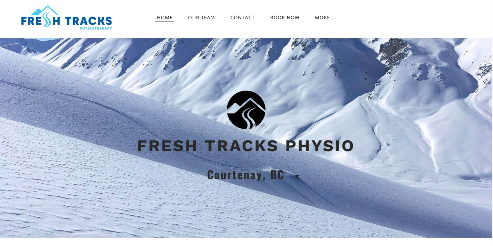
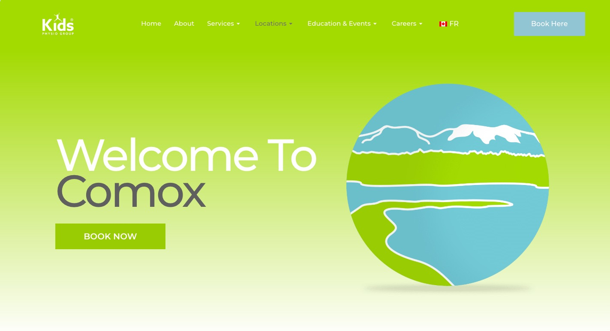

# Final Project HTML-CSS

## Project scope

The goal is to redesign the physiotherapy website with a more attractive and user-friendly layout. This includes a modern, clean design with clear sections for homepage, services,and contact information. The homepage will feature bold images and icons, making it visually appealing. The navigation will be simple, with a menu that’s easy to follow. The website will be fully responsive, ensuring it looks great on all devices. The code will be optimized for fast loading and easy updates, providing a seamless user experience with a professional look.

### 1. Choose a site to redesign

Website chosen: https://ascentphysiotherapy.com/index.html

### 2. Inspiration

**1. Fresh Tracks Physiotherapy**

- https://www.freshtracksphysio.ca/
  

**2. Kids Physiotherapy**

- https://www.kidsphysio.ca/locations/comox-valley/
  

## Instructions

### 1. Add HTML content to each cell

- In VS Code, create two new files called index.html and style.css. Link the external stylesheet to the HTML file. Make regular commits and label the commits appropriately.

- Create two files called ourteam.html and ourservices.html

### Page 1 - Homepage:

**1. Header:**

- Add a logo image and create a navigation bar with links to different sections of the site (e.g., Home, Services, Our team).

- Main Navigation included:
  - Homepage
  - Our team
  - Our services (Products + rates)

**2. Main:**

- Must include 6 content blocks minimum
- Add a video and content for hero section
- **About us:** Add background image or image and content

- **Why choose us:** Add image and content (optional: Button)

- **Our work/mission and vision:** Add image and content (optional: Button)

- Create three facilities articles with button

- Create call-to-action section for booking.

**3. Footer:**

- Add contact information
- Embed map for business location
- Copyright Notice: “© [Year] [Company Name]. All rights reserved.”

### Page 2 - Our team:

**1. Header:**

- Add a logo image and create a navigation bar with links to different sections of the site (e.g., Home, Services, Our team).

- Main Navigation included:
  - Homepage
  - Our team
  - Our services (Products + rates)

**2. Main:**

- Must include 4 content blocks minimum
- Add a image or background for hero section
- **Our story:** Add background image or image and content

- **Our therapists:** Create 6 article with short content

- **Our patient coordinators:** Create 2 article with short content

**3. Footer:**

- Add contact information
- Embed map for business location
- Copyright Notice: “© [Year] [Company Name]. All rights reserved.”

### Page 3 - Our services:

**1. Header:**

- Add a logo image and create a navigation bar with links to different sections of the site (e.g., Home, Services, Our team).

- Main Navigation included:
  - Homepage
  - Our team
  - Our services (Products + rates)

**2. Main:**

- Must include 4 content blocks minimum
- **Service fees:** Create a table for the prices

- **Physiotherapy rates:** Create a table for the service rates

- **Products:** Create 6 articles with button

- **Call-to-action:** Add content/image with button for booking

**3. Footer:**

- Add contact information
- Embed map for business location
- Copyright Notice: “© [Year] [Company Name]. All rights reserved.”

### 2. Code the content blocks for mobile

Code each one of chosen content blocks for mobile:

- HTML should be clean and semantics
- The CSS should be well organised
- Use padding and margin to control the vertical space in the layout.
- Use the Responsive Nav codepen as inspiration: https://codepen.io/AskClaireGuiot/pen/BaMydwd?editors=1100 for hamburger menu.
- Make sure that mobile HTML and CSS are perfectly finished and CSS is well organized before move on to coding for desktop

### 3. Code the content blocks for desktop

- Add in the desktops media query: _@media only screen and (min-width: 1200px) {}_
- All the CSS need to adapt the layout so that it looks like the desktop version

### 4. Add styling for each page

**1. Fonts:**

- 2 Google fonts: Sans Serif
  - Geist (https://fonts.google.com/specimen/Geist)
  - Barlow Condensed (https://fonts.google.com/specimen/Barlow+Condensed)
- The 62.5% trick
- Text formatting properties: font-family, font-weight, font-size, text-decoration, color

**2. Colours:**

- Three main colours: Light blue (#d0e7ec), dark blue (#0a558e), brick orange (#e05a2a)

**3. Images:**

- Logo: Use original logo image on the website for navigation
- Research high resolution images for other section ([unplash.com](https://unsplash.com/))

**4. Page layout:**

- Incorporate using flexbox, grid, table, float & clear properties, overflow, box-sizing, position property
- Box model properties: padding, margin, border, background, border-radius, box-shadow, width

### 5. Format, organize and add comments

- Use the Prettier VSCode extension to format HTMl and CSS code
- Add organizational CSS comments and order style rules so that your CSS is easy to read
- Add a few comments to explain the HTML and CSS code and highlight important notices

### 6. Check for errors

- Use the VSCode HTMLHint extension and validate the HTML code to make sure that it is correct: https://validator.w3.org/#validate_by_upload. Take a screenshot of the results.
- Validate the CSS code to make sure that it is correct: https://jigsaw.w3.org/css-validator/ for CSS. Take a screenshot of the results.

**Testing:**

- Go to https://wave.webaim.org and enter the chosen website's URL in the web address field to check the accessibility of the website. Check out all the accessibility errors and alerts in the Details tab.
- In Chrome, on the website's homepage, open the Developer Tools. Go to the Lighthouse tab, leave all settings as they are and click "Analyze page load".
